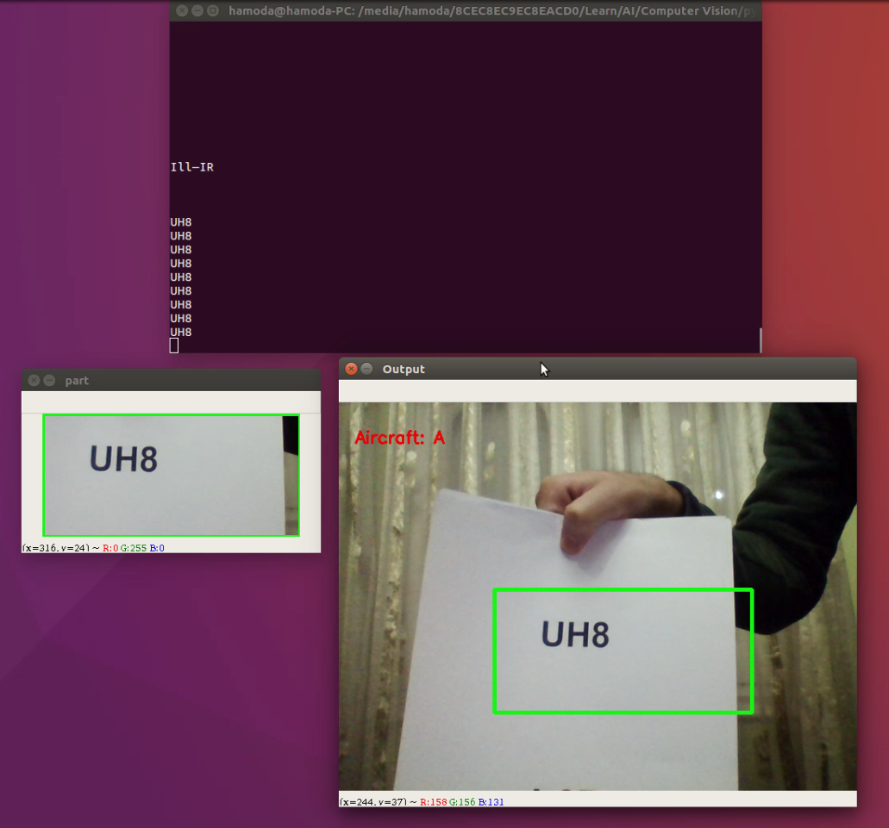
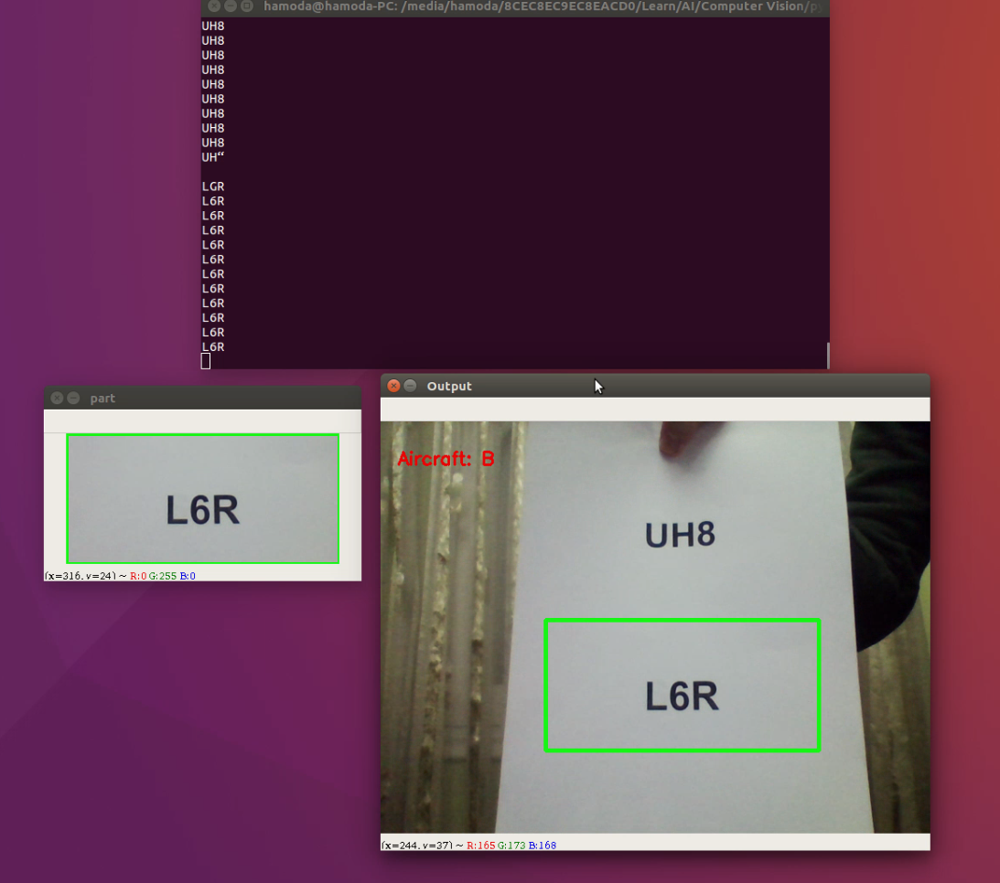
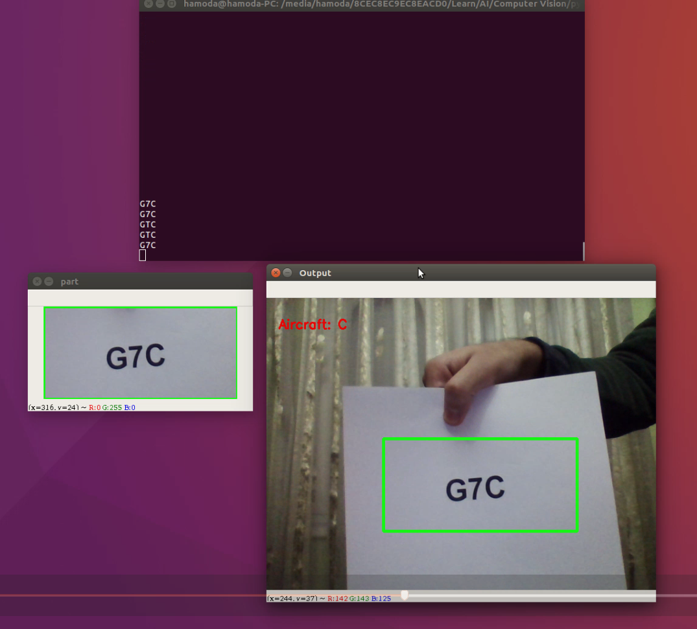
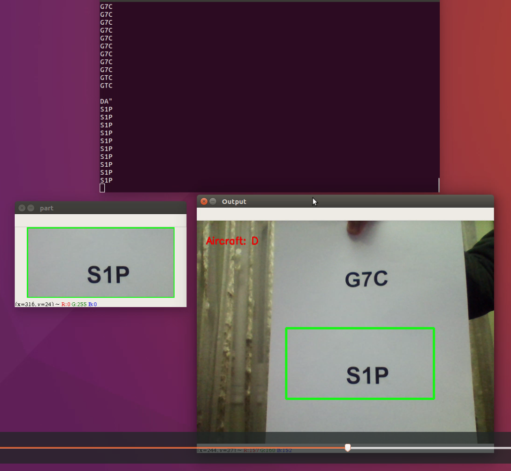
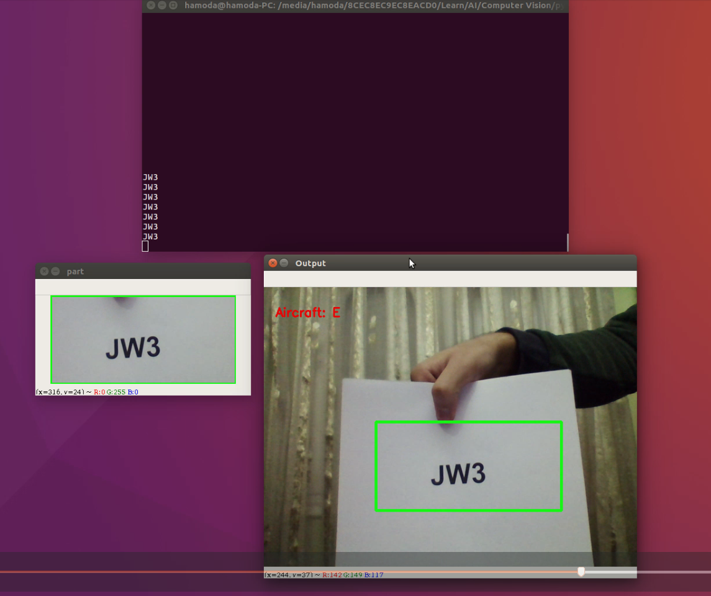
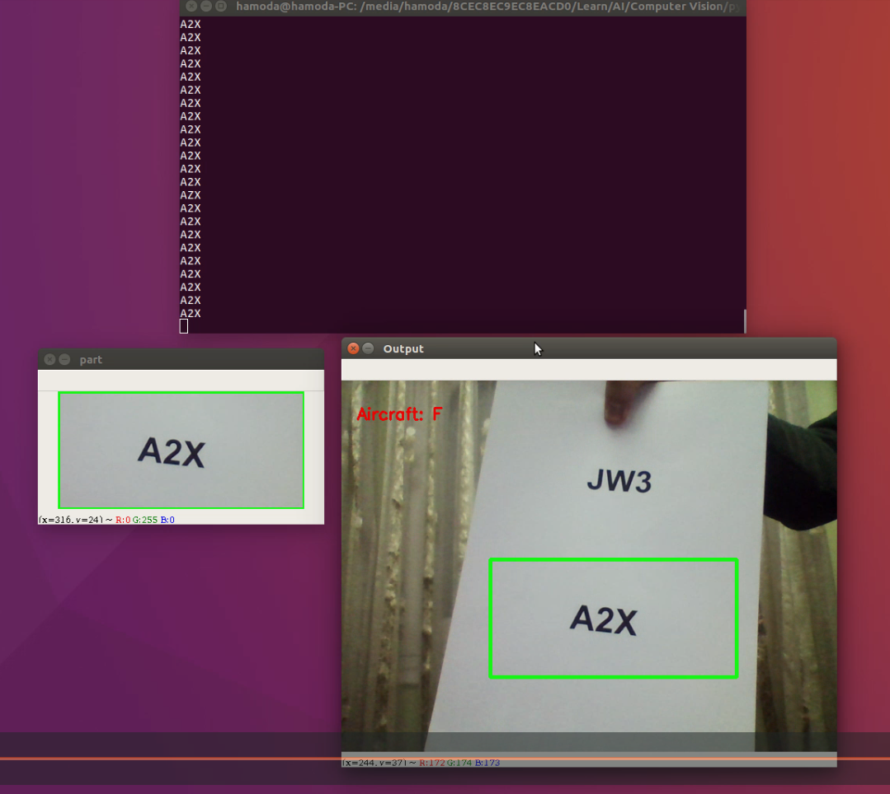

# ROV-Vision-System
Vision system for ROV MATE competition. This system uses shape, color and text Detection of aircrafts' tails to help identyfing aircraft's model after crash accidents.

# Color Detection
Video demo
https://www.youtube.com/watch?v=MYbGCYb51sc

# Text Detection Based on Tesseract OCR

